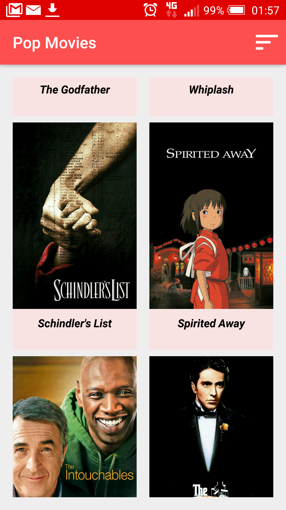
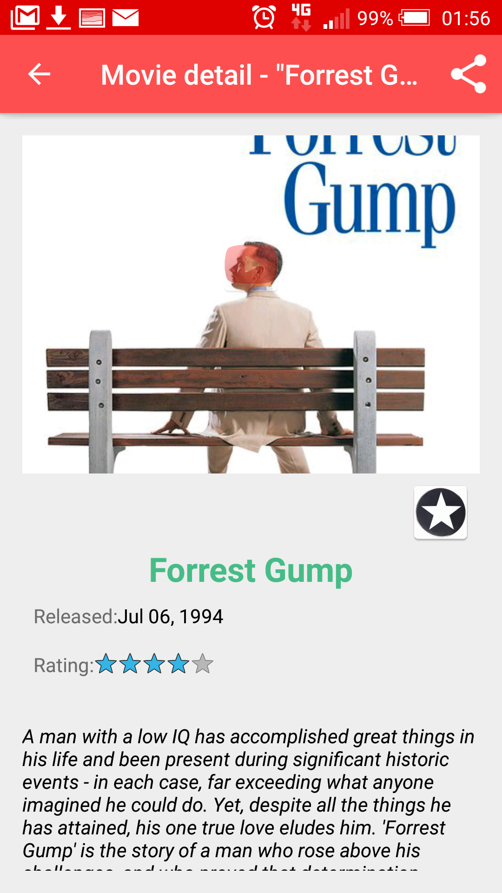

# Popular Movies

Here is a simple and colorful android app which I made for "Android Developer Nanodegree" - Project 2.


## Features

With the app, you can:
* Discover the movies most popular or the most rated 
* Read reviews 
* Watch Video, Save Favorite .......

## How to Work with the Source

This app uses [The Movie Database](https://www.themoviedb.org/documentation/api) API to retrieve movies.
You must provide your own API key in order to build the app. When you get it, just paste it to:
    ```
    app/build.gradle ... $MOVIE_DB_API_KEY
    ```

## Screens






## Libraries

* [Glide](https://github.com/bumptech/glide)
* [Retrofit] (https://square.github.io/retrofit/)
* [Butter Knife] (https://jakewharton.github.io/butterknife/)


## License

    Copyright 2016 Benedetto Pellerito

    Licensed under the Apache License, Version 2.0 (the "License");
    you may not use this file except in compliance with the License.
    You may obtain a copy of the License at

        http://www.apache.org/licenses/LICENSE-2.0

    Unless required by applicable law or agreed to in writing, software
    distributed under the License is distributed on an "AS IS" BASIS,
    WITHOUT WARRANTIES OR CONDITIONS OF ANY KIND, either express or implied.
    See the License for the specific language governing permissions and
    limitations under the License.
